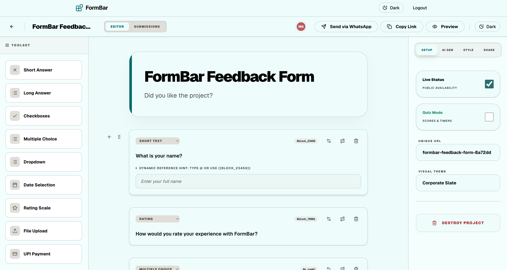

# FormBar



> **2nd Place Winner at ACM MPSTME ReCode 2026**

FormBar is a modern, full-stack application for building and managing forms, featuring a FastAPI backend and a Next.js frontend.

## Features

- **AI-Powered Forms**: Seamlessly generate, optimize, and interact with forms using built-in AI capabilities.
- **Interactive WhatsApp Bot**: Collect form responses seamlessly through an intelligent, conversational WhatsApp bot. Users can fill out forms entirely within their WhatsApp chat interface.
- **Embeddable Widget**: Easily integrate forms into any external website using a lightweight, drop-in JavaScript widget.
- **Organization & Workspace Management**: Multi-tenant architecture supporting team collaboration, projects, and role-based access.
- **Real-Time Updates**: WebSocket integration for live data syncing and notifications.
- **Robust Tech Stack**: Lightning-fast API powered by FastAPI (Python), state-of-the-art Next.js 16 frontend, and a highly scalable data layer (PostgreSQL, ClickHouse, MongoDB, Redis, and RustFS).

## Architecture

- **Frontend**: Next.js 16 with React 19, TypeScript, and Tailwind CSS.
- **Backend**: FastAPI (Python 3.13) with SQLAlchemy (PostgreSQL), Redis (OTP/Caching), and Motor (MongoDB).
- **Infrastructure**: Docker Compose manages multiple services including PostgreSQL, Redis, MongoDB, and RustFS.

## Local Development

### Prerequisites

- Docker and Docker Compose
- Node.js (for local linting/types)
- Python 3.13 (for local development)

### Getting Started

1. Clone the repository.
2. Create a `.env` file from `.env.example`:
   ```bash
   cp .env.example .env
   ```
3. Start the services using Docker Compose:
   ```bash
   docker compose up --build
   ```

The application will be available at:
- Frontend: http://localhost:3000
- Backend: http://localhost:8000

### Hot-Reloading

Both the frontend and backend are configured for hot-reloading:
- **Backend**: Source code is mounted from `./Backend/src`.
- **Frontend**: The entire `./Frontend` directory is mounted.

## Service Ports

- Frontend: 3000
- Backend API: 8000
- PostgreSQL: 5432
- Redis: 6379
- MongoDB: 27017
- RustFS: 9001 (Console), 9002 (API)

## Backend Structure

- `app/core`: Configuration, database engines, and security.
- `app/models`: SQLAlchemy and Pydantic models.
- `app/routers`: FastAPI route definitions.
- `app/services`: Business logic and third-party integrations.
- `app/schemas`: Data validation schemas.
